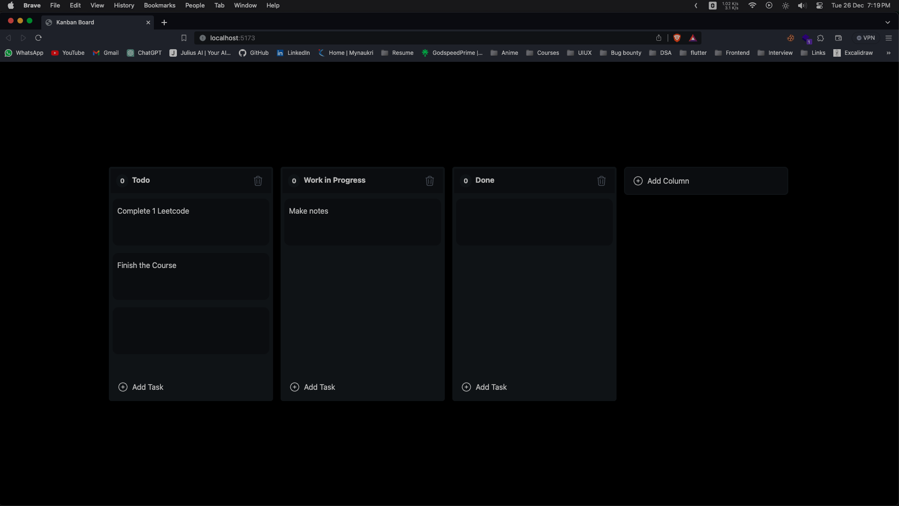

# Kanban Board

### Implemented KanbanBoard

**Link to project :** [https://kanbanboard6298.netlify.app/]

## How It's Made:

**Tech used:** React, TypeScript, TailwindCSS and dnd-kit.

- Build front-end with React
- Build reusable function components
- Styled components using Tailwind CSS
- Used dnd-kit to make components Dragable
